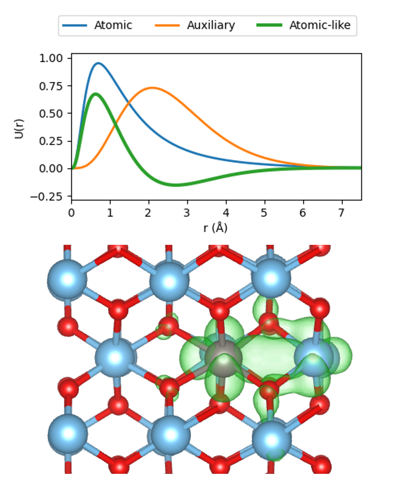

<table>
  <tr>
    <!-- First Column: Text -->
    <td style="width: 50%; padding-right: 20px;">
      
This repository contains data from the publication:

      
<i>Machine learning generalised DFT+U projectors to model polarons in a numeric atom-centred orbital framework</i>

    </td>
    
    <!-- Second Column: Image -->
    <td style="width: 50%; text-align: center;">
      
    </td>
  </tr>
</table>
