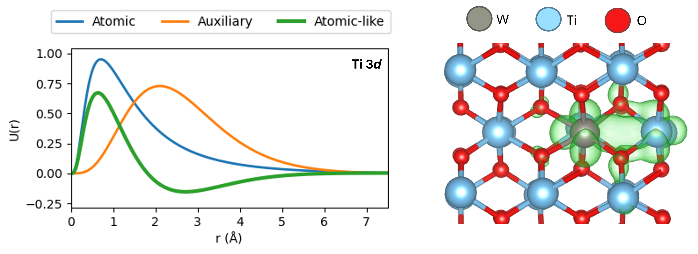

# Machine learning generalised DFT+U projectors

This repository contains data from the publication: Machine learning generalised DFT+U projectors to model polarons in a numeric atom-centred orbital framework

  
   
  <em>Tuning Hubbard projectors as a linear combination of numeric atom-centred orbital basis functions, for the simulation of polarons in strongly correlated metal oxides.</em>

