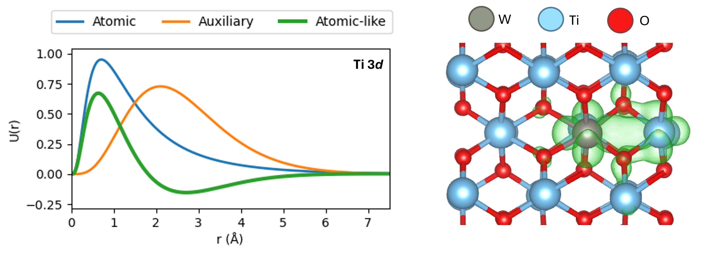
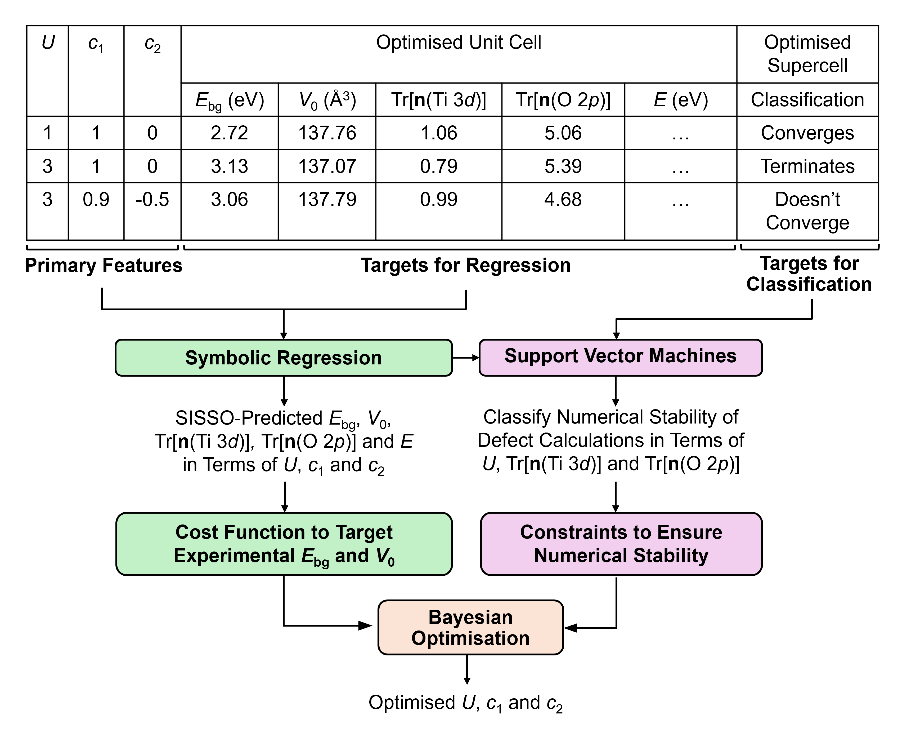

# Machine learning generalised DFT+<em>U</em> projectors

This repository contains data from the publication (under review): Machine learning generalised DFT+<em>U</em> projectors to model polarons in a numeric atom-centred orbital framework

  
   
  <em>Tuning Hubbard projectors as a linear combination of numeric atom-centred orbital basis functions, for the simulation of polarons in strongly correlated metal oxides.</em>

# Semi-empirical approach

  
   
  <em>Integrating symbolic regression, support vector machines and Bayesian optimisation to optimise the Ti 3<em>d</em> Hubbard <em>U</em> value and projectors.</em>

# First-principles approach
