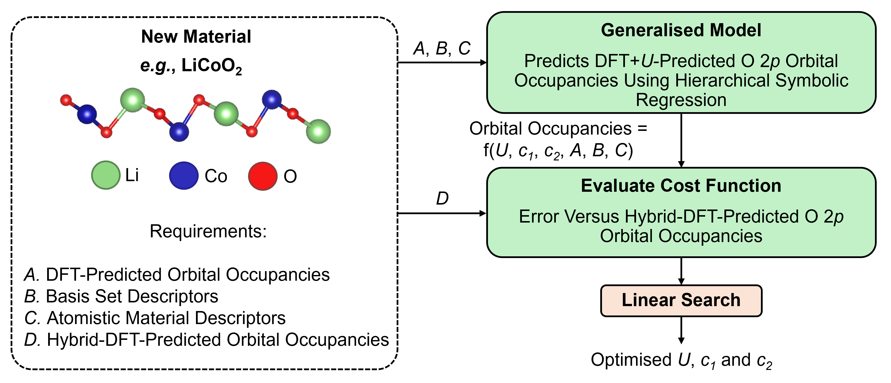

  <h1 align="center">Machine learning generalised DFT+<em>U</em> projectors</h1>
  

    This repository contains data from the publication (under review): Machine learning generalised DFT+<em>U</em> projectors to model polarons in a numeric atom-centred orbital framework
  

  

    
     
    <em>Tuning Hubbard projectors as a linear combination of numeric atom-centred orbital basis functions, for the simulation of polarons in strongly correlated metal oxides.</em>
  

  <h1 align="center">Semi-empirical approach</h1>

  `Scripts/Semi-empirical Approach/Bayesian.py` contains a script to optimise the Ti 3<em>d</em> Hubbard <em>U</em> value and projector for anatase TiO2 using Bayesian optimisation with a cost function defined using symbolic regression and constraints defined using support vector machines.
  
  

    
     
    <em>Integrating symbolic regression, support vector machines and Bayesian optimisation to optimise the Ti 3<em>d</em> Hubbard <em>U</em> value and projectors.</em>
  

  <h1 align="center">First-principles approach</h1>
  `Scripts/First-principles Approach/Screening/References.txt` contains all requirements for screening the the Hubbard <em>U</em> values and projectors of different materials
  `Scripts/First-principles Approach/Screening/HI-SISSO.py` contains hierarchical symbolic regression-defined expressions to calculate DFT+U-predicted orbital occupancies for the materials specified in `Scripts/First-principles Approach/Screening/References.txt`
  `Scripts/First-principles Approach/Screening/screen_materials.py` uses `Scripts/First-principles Approach/Screening/HI-SISSO.py` to perform a linear search of the cost function for all materials specified in `Scripts/First-principles Approach/Screening/References.txt`
  `Scripts/First-principles Approach/Screening/Familyofsolutions.py` uses the outputs from `Scripts/First-principles Approach/Screening/screen_materials.py` to plot the Hubbard <em>U</em> value and projector coefficients c1 and 2 that minimise the cost function, for each material specified in `Scripts/First-principles Approach/Screening/References.txt`
  
  

    
     
    <em>Developing a first-principles workflow for optimising Hubbard <em>U</em> values and projectors using hierarchical symbolic regression.</em>
  

